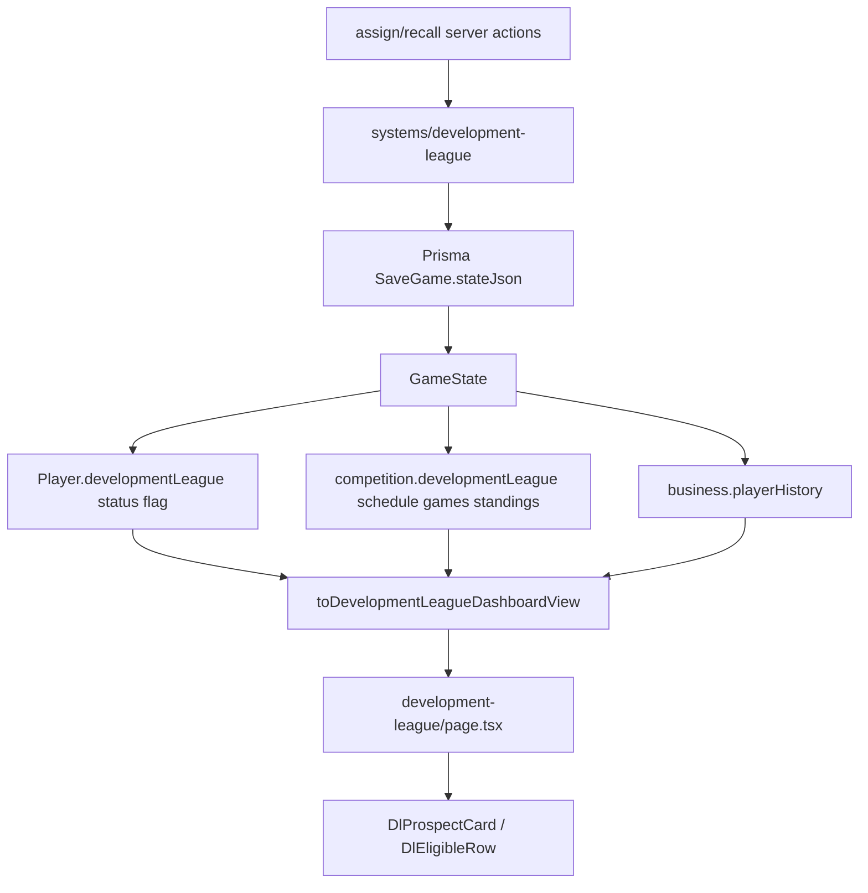

# Issue #57 — Developmental League Visuals

Plan target after approval: [docs/plans/issue-57-developmental-league-visuals.md](docs/plans/issue-57-developmental-league-visuals.md). Task 0 creates `docs/plans/`; Task 8 writes the file.

Issue: [lil-brisket/ballsim#57](https://github.com/lil-brisket/ballsim/issues/57) — “majority of the developmental league is to progress players with lower overalls; users will not need to manage the developmental but they should be able to see how their players/teams are doing.” No screenshot was attached on GitHub; this plan is grounded in the live route and BallSim design system.

---

## 1. Executive Summary

The Development League already has a full simulation and assignment system inside serialized `GameState`. The current hub at [`src/app/dashboard/[saveId]/development-league/page.tsx`](src/app/dashboard/[saveId]/development-league/page.tsx) is a dense, action-heavy table page that treats Assign/Recall as first-class.

Issue #57 should **redesign that hub as a secondary observational pipeline**, not add league tables, sim rules, or Prisma models.

**Change:** selector view-model extensions + page/component presentation.

**Do not change:** DL assignment/sim systems, player-development algorithms, Prisma schema, main nav as a peer of the top league, or the Player Development hub’s change-first roster table (except importing a extracted history helper).

No Prisma migration is required.

**Critical path:** `0 → 1 → 2 → {3, 4, 5} → 6 → 7 → 8`. Tasks 3, 4, and 5 depend only on Task 2 and may run in parallel. Task 6 depends on Task 4 (pipeline cards exist so assignment can sit below them). Numbered order is not strict serial execution except along that path.

---

## 2. Issue Intent

The DL is a **read-only developmental pipeline / secondary competition**. The owner should glance and answer:

1. Who is developing?
2. Who is improving?
3. Who may be ready soon?
4. How is the developmental squad performing?

Management (Assign/Recall, eligibility, recommendation copy) stays available but **visually secondary**. Primary operational Assign/Recall already lives on the player overview via [`DevelopmentLeaguePlayerActions`](src/components/player-profile/DevelopmentLeaguePlayerActions.tsx).

**Ready-for-recall UX:** “Ready” is a `StatusBadge` on the prospect card, not a duplicate table. Each ready card shows its **Recall button inline** next to that badge so the status and the action co-locate. Ready is actionable, not decorative.

---

## 3. Current Repository State

### Already implemented (preserve)

- Dedicated route: [`src/app/dashboard/[saveId]/development-league/page.tsx`](src/app/dashboard/[saveId]/development-league/page.tsx)
- View model: [`toDevelopmentLeagueDashboardView`](src/state/development-league-selectors.ts) / `DevelopmentLeagueDashboardView`
- Loader: `loadDevelopmentLeagueHubView` in [`src/application/game-service.ts`](src/application/game-service.ts)
- Player assignment flag: `Player.developmentLeague.status === "assigned"` ([`src/domain/entities/development-league.ts`](src/domain/entities/development-league.ts))
- Invariant: `Player.teamId` = franchise ownership; `Team.roster` = top-league only; assigned players are **not** on `Team.roster` ([`franchise-membership.ts`](src/systems/development-league/franchise-membership.ts))
- Competition slice: `GameState.competition.developmentLeague.{schedule, games, standings}` ([`src/state/game-state.ts`](src/state/game-state.ts))
- Derived readiness: `getDevelopmentReadiness` (`ready` / `near_ready` / `developing` / `not_ready`)
- Record, recall candidates, developing prospects, notable PPG, last 5 results, eligible-to-assign
- Assign/Recall server actions + player-profile + post-draft assign
- Cross-link from Player Development header; offseason quick link; **no sidebar item** ([`owner-nav-config.ts`](src/application/owner-nav-config.ts) Team group has `/development` only)
- Persistence envelope: Prisma `SaveGame.stateJson` only ([`prisma/schema.prisma`](prisma/schema.prisma) lines 13–21). Mapper v55→v56 already seeds DL fields.
- `DL_MAX_SEASONS` is already exported from [`src/domain/entities/development-league.ts`](src/domain/entities/development-league.ts) and re-exported from [`src/domain/entities/index.ts`](src/domain/entities/index.ts). UI imports from `@/domain/entities` (or that entity module). **Do not touch** `src/systems/development-league/**`.

### Existing but visually weak (redesign)

- Header is text-only (`teamName`); no parent branding
- Record + readiness are ad-hoc chips, not `StatCard` / `StatusBadge`
- Pipeline is two wide 9-column tables with Context bullets + Recall on every row
- `role`, `rpg`, `apg`, `seasonsRemaining` exist on `DlProspectRowView` but are underused
- Notable performance is a plain name list (no `PlayerEntityLink`), PPG-only, no games-played floor
- Recent results are a custom `<ul>` (abbr + score); skips [`GameRow`](src/components/basketball/GameRow.tsx)
- Eligible-to-assign is equal visual weight to the pipeline
- Vocabulary collision: “developing” = career stage on Development, readiness on DL

### Actually missing (add as presentation-only)

- Season-over-season OVR delta for **assigned** players (history already exists; Development hub uses it only for `Team.roster`)
- Potential headroom (clamped; see Section 6)
- Visual tenure (season N of `DL_MAX_SEASONS`)
- Parent franchise identity on the hub, with a null-branding fallback
- Compact DL rank/streak from existing `standings.byTeamId` (optional, supporting, deterministic tiebreak)
- Opponent id + branding on recent results
- Distinct empty copy for “nobody assigned” vs “assigned, no games yet”
- Presentational React coverage for extracted DL components

### Type consumers (verified)

Adding fields is additive. Coordinate fixture updates; do not treat this as single-file-only.

- `DlProspectRowView`: defined in selectors; used by [`DlProspectRow.tsx`](src/components/development-league/DlProspectRow.tsx); page-local `ProspectTable` props; **literal fixtures** in [`tests/unit/development-league-hub-selectors.test.ts`](tests/unit/development-league-hub-selectors.test.ts) (must be updated in Task 2)
- `DevelopmentLeagueDashboardView`: selectors + return type of `loadDevelopmentLeagueHubView` in [`src/application/game-service.ts`](src/application/game-service.ts) (structural; extra fields flow through)
- `toDevelopmentLeagueDashboardView`: also called by [`tests/unit/phase4-simulation-refresh.test.ts`](tests/unit/phase4-simulation-refresh.test.ts), which only asserts `.prospects` and `.summary` exist — no fixture rewrite expected

Keep the view type name `DlProspectRowView` (churn). Rename only the React component (Section 5).

### Prisma

**No migration.** Do not add a `DevelopmentLeague` model or tables.

---

## 4. Existing Development League Architecture

Authoritative sim state stays in systems. The hub only **selects**. `getRecentForm` in [`src/state/recent-form-selectors.ts`](src/state/recent-form-selectors.ts) reads `competition.games` (top league) and must not be reused or parameterized for DL — that would contaminate the shared recent-form contract. Align DL result **row fields** with what [`GameRow`](src/components/basketball/GameRow.tsx) already accepts (`opponentTeamId`, `opponentName`, `opponentBranding`, scores, `won`). Wrap them in a **thin new** `DlTeamPerformancePanel`. Do not fork [`RecentResultsPanel`](src/components/owner/dashboard/RecentResultsPanel.tsx).

**Box-score constraint:** [`canOpenGameBoxScore`](src/state/selectors.ts) / `toGameBoxScoreView` look up `state.competition.games` only. DL game IDs live under `competition.developmentLeague.games`. `GameRow` on this page must use `canOpenResult={false}`. Do not expand box-score infrastructure in #57.

**Defensive selector:** if `status === "assigned"` but the player is missing from DL standings/schedule or `currentSeasonStats` is absent (drift / mid-migration), return identity + readiness with `mpg`/`ppg`/`rpg`/`apg` as `null`. Do not throw.

---

## 5. Component Inventory

### Reuse unchanged

- [`PageHeader`](src/components/ui/PageHeader.tsx), [`Section`](src/components/ui/Section.tsx), [`EmptyState`](src/components/ui/EmptyState.tsx) / `ErrorState`
- [`PlayerEntityLink`](src/components/entity/PlayerEntityLink.tsx), [`TeamEntityLink`](src/components/entity/TeamEntityLink.tsx)
- [`StatusBadge`](src/components/ui/StatusBadge.tsx) — ready=`success`, near_ready=`warning`, developing/not_ready=`neutral`/`info`
- [`StatCard`](src/components/ui/StatCard.tsx), [`Metric`](src/components/ui/Metric.tsx), [`Panel`](src/components/ui/Panel.tsx), [`ProgressBar`](src/components/ui/ProgressBar.tsx), [`StatLine`](src/components/basketball/StatLine.tsx)
- [`TeamIdentityInline`](src/components/team/TeamIdentityInline.tsx), [`TeamBadge`](src/components/owner/TeamBadge.tsx), [`TeamLogoMark`](src/components/team/logos/TeamLogoMark.tsx), [`toBrandingView`](src/state/team-branding-view.ts)
- [`GameRow`](src/components/basketball/GameRow.tsx) with `canOpenResult={false}`
- Tokens in [`src/components/ui/styles.ts`](src/components/ui/styles.ts): `panelClass`, `panelDashedClass`, `densityPadding`, `densityGap`, `densitySectionSpace`, `focusRingClass`
- Assign/Recall **actions** (same forms); player-profile [`DevelopmentLeaguePlayerActions`](src/components/player-profile/DevelopmentLeaguePlayerActions.tsx) unchanged

`PlayerCard` / `TeamCard` / `ActionCard` are close but wrong semantics (`ActionCard` is CTA-reserved; `PlayerCard` lacks readiness/delta). Do not force-fit them.

**ProgressBar a11y (leave the component unchanged):** [`ProgressBar`](src/components/ui/ProgressBar.tsx) sets `role="progressbar"`, `aria-valuemin={0}`, `aria-valuemax={100}`, `aria-valuenow={Math.round(pct)}` where `pct` is derived from `value / max`. Tenure `2` of `3` therefore announces **67 of 100**, not `2` of `3`. Pass `value={dlSeason}`, `max={DL_MAX_SEASONS}`, and `aria-label="Development League tenure: 2 of 3 seasons"` so the accessible name carries the real units. Do not change `ProgressBar` in this issue.

### Reuse with modification

- [`DlProspectRow.tsx`](src/components/development-league/DlProspectRow.tsx) — **git-rename to `DlProspectCard.tsx`**, export `DlProspectCard`, update the page import, delete the page-local `ProspectTable` helper in the same commit. Keep `DlEligibleRow` in that file (mobile card / `md+` compact table).
- [`DlProspectRowView`](src/state/development-league-selectors.ts) / `DlRecentResultView` / `DevelopmentLeagueDashboardView` (fields only; type names stay)
- Cross-link copy on [`development/page.tsx`](src/app/dashboard/[saveId]/development/page.tsx) only if needed for discoverability (keep Development page otherwise)

### Build new (minimal)

- `DlPipelineSummary` — StatCard/Metric strip: record, assigned count, ready, near-ready, developing (optional compact rank/streak). Grid: `grid grid-cols-2 sm:grid-cols-3 lg:grid-cols-5` plus `densityGap`.
- `DlProspectCard` — renamed from `DlProspectRow` (not a second component beside it)
- `DlTeamPerformancePanel` — **thin new wrapper** around `GameRow` + `EmptyState`. Not a fork of `RecentResultsPanel`. Not inlined on the page.

Do **not** build a DL standings table, new logo catalog entry, or public raster assets. [`public/`](public/) has only Next placeholders; logos are React SVGs.

---

## 6. Data / Selector Assessment

File: [`src/state/development-league-selectors.ts`](src/state/development-league-selectors.ts)

**Already sufficient:** record W–L; readiness buckets; recall vs developing split; last 5 finals; eligible + `strongCandidate`; OVR, POT, age, `dlSeason`, `seasonsRemaining`, role, MPG/PPG/RPG/APG, `whyBullets`.

**Add (derived, deterministic, not persisted):**

- **`changeDelta` / `changeLabel`** — same rules as private `changeFromHistory` in [`development-hub-selectors.ts`](src/state/development-hub-selectors.ts). Extract to [`src/state/player-overall-change.ts`](src/state/player-overall-change.ts) in its **own first commit** with a direct unit test. Missing/empty history → `delta: null`, `label: null` (not `0`).
- **`potentialHeadroom`** — `Math.max(0, potential - overall)`. Never ship a negative number. UI: if `0`, show muted “At ceiling” (covers equal and over-ceiling scouting variance); otherwise show the integer headroom.
- **`assignedCount`** — `prospects.length`.
- **Parent identity** — always include `city`, `name`, `abbreviation`, and `branding: toBrandingView(team.branding)` (nullable). Header never depends on branding being non-null.
- **`opponentTeamId`, `opponentName`, `opponentBranding`** on recent results — from `world.teams`; branding may be null.
- **Optional `leagueRank`, `streakLabel`** — rank from sorting `developmentLeague.standings.byTeamId` with deterministic tiebreak: `winPercentage` desc, then `wins` desc, then `abbreviation` `localeCompare`. If standings are missing, omit rank (do not invent). Prefer dropping the metric over a flickering rank.
- **Notable performance** — `ppg >= 10` **and** `currentSeasonStats.games >= 5`. Small-sample spikes are not notable. Render via `PlayerEntityLink` + existing RPG/APG. Ready stays visually above high PPG.
- **`whyBullets` fallback** — if the derived list is empty, selector supplies one line: `"Readiness based on current OVR and projected top-league minutes."` Cards always have a one-line reason.

**`changeDelta` UI (cards, not color-only):**

- `null` → muted `—` with `aria-label="No season-over-season history"`
- `0` → neutral `0`
- `> 0` → emerald `+N`
- `< 0` → rose `−N`

A brand-new assignment with no history must not look like “no improvement.”

**Do not add:** new sim stats, composite “impact” scores, duplicated Development-hub career-stage columns, or a second notable-improvers list that clones the Development page.

---

## 7. UX / Visual Direction

Keep BallSim dark zinc chrome. Accent remains amber. Progression: emerald (ready / positive delta / win), amber (near-ready), zinc (developing / not ready), rose (loss / notable decline). Never color-only: pair with `StatusBadge` labels, `+N`/`—` text, W/L text.

**Identity:** parent franchise colors + generated `TeamLogoMark`. Subtitle “Development League” (secondary, not a second team). No new palette, no fake affiliate logo.

**Null branding fallback:** `toBrandingView` returns null on invalid/legacy data. Header still renders `TeamIdentityInline` with `city`, `name`, `abbreviation` and `branding={null}` — that component already falls back to an abbreviation monogram. Do not leave the header empty.

**Density:** summary cards + prospect cards first. Eligible assignment uses a **card layout below `md`**, and a **compact 5-column table from `md` up** (Player, OVR, POT, Recommendation, Action). No leftover wide `overflow-x-auto` table as the mobile story.

**Vs Development page:** Development = “who is changing on the top-league roster?” (stage + OVR delta). DL = “how are assigned prospects progressing and how is the DL squad doing?” Overlap is OVR/POT formulas only. Eligible-to-assign players appear on both; DL is the only place with Assign + DL stats.

---

## 8. Proposed Page Information Architecture

Keep the dedicated route. Reorder and reweight:

1. **Header / identity** — `PageHeader` title “Development League”; subtitle via `TeamIdentityInline` + “developmental pipeline”; keep links to Player Development and Roster (`focusRingClass`).
2. **Summary** — `DlPipelineSummary` with the `grid-cols-2 sm:grid-cols-3 lg:grid-cols-5` grid.
3. **Pipeline (primary)** — `data-testid="dl-pipeline"`. Single “Assigned prospects” section, sorted `sortDlProspects` (ready first). Ready cards: emerald treatment + **inline Recall**. Near-ready amber. Others zinc. Empty: “No prospects assigned.”
4. **Who is improving / notable** — compact list: positive `changeDelta` first; PPG notables (min 5 games) as supporting lines.
5. **Squad performance** — `DlTeamPerformancePanel`. Empty when assigned and no finals: “DL season has not started; assigned prospects will appear here.” Empty when nobody assigned: “No prospects assigned.”
6. **Assignment (secondary)** — `data-testid="dl-assign"` with a muted/secondary class (`text-zinc-500` / reduced contrast, not a second hero). Title “Assign from roster.” Mobile cards; `md+` compact table.

---

## 9. Ordered Implementation Tasks

**Critical path:** `0 → 1 → 2 → {3, 4, 5} → 6 → 7 → 8`. Tasks 3, 4, and 5 may proceed in parallel after Task 2.

### Commit boundaries

1. Helper extract (`player-overall-change.ts` + tests + hub rewire)
2. DL selector fields + DL selector/fixture tests
3. `DlPipelineSummary` + header identity
4. `DlProspectCard` (git rename + delete `ProspectTable`)
5. `DlTeamPerformancePanel`
6. Eligible de-emphasis (`DlEligibleRow` + page section)
7. Route composition / responsive / a11y
8. `docs/plans/issue-57-developmental-league-visuals.md`

### Task 0 — Pre-flight (S)

- Confirm `DL_MAX_SEASONS` export (already true: `@/domain/entities`)
- Re-grep `DlProspectRowView` / `DevelopmentLeagueDashboardView` consumers
- Confirm `ProgressBar` percentage-scale aria (leave it)
- `mkdir` `docs/plans/` if missing
- Baseline: `npm run test:unit` (or `npm test` if you want the full CI suite)
- Deps: none

### Task 1 — Confirm data contract (S)

- Read-only check of selectors + [`tests/unit/development-league-hub-selectors.test.ts`](tests/unit/development-league-hub-selectors.test.ts)
- Deps: Task 0

### Task 2 — Selectors (S/M), two commits

**Commit 1 — extract only**

- Create [`src/state/player-overall-change.ts`](src/state/player-overall-change.ts)
- Rewire [`development-hub-selectors.ts`](src/state/development-hub-selectors.ts) (behavior unchanged)
- Tests: **new** [`tests/unit/player-overall-change.test.ts`](tests/unit/player-overall-change.test.ts) — missing history → null; last year &lt; current → live delta; same-year with prior snapshot → snapshot delta; single same-year snapshot → null delta + label; existing [`tests/unit/development-hub-selectors.test.ts`](tests/unit/development-hub-selectors.test.ts) still sorts by delta

**Commit 2 — DL view-model fields**

- Modify [`src/state/development-league-selectors.ts`](src/state/development-league-selectors.ts)
- Add branding, change delta, clamped headroom, assignedCount, result opponent fields, optional rank (tiebreak above), notable `minGames >= 5`, whyBullets fallback, defensive null stats
- Update `DlProspectRowView` fixtures in [`tests/unit/development-league-hub-selectors.test.ts`](tests/unit/development-league-hub-selectors.test.ts)
- New cases: empty games; missing history (`changeDelta` null not 0); PPG notable rejected when `games < 5`; newest-first results; branding null; assigned player with no standings/schedule/stats → no throw, null averages; rank stable on tied wins
- Deps: Task 1

### Task 3 — Summary / identity presentation (M)

- Modify the DL page; create `src/components/development-league/DlPipelineSummary.tsx`
- `TeamIdentityInline` with always-present city/name/abbr; `branding` may be null
- StatCard grid as specified
- Tests: `tests/react/dl-pipeline-summary.test.tsx` — counts, record dash when null, ready label, header identity still renders with `branding={null}`
- Deps: Task 2 only (parallel with 4 and 5)

### Task 4 — `DlProspectCard` (M)

- `git mv` [`DlProspectRow.tsx`](src/components/development-league/DlProspectRow.tsx) → `DlProspectCard.tsx`; export `DlProspectCard`; update page import; delete `ProspectTable`
- Tenure `ProgressBar` `max={DL_MAX_SEASONS}` imported from `@/domain/entities`; `aria-label` with “N of 3 seasons”
- Ready cards: badge + **inline Recall**
- `changeDelta` rendering per Section 6; whyBullets first line or selector fallback
- Tests: `tests/react/dl-prospect-card.test.tsx` — name link; Ready badge; Recall present on ready; null delta → `—` + aria-label; positive emerald `+N`; tenure label
- Deps: Task 2 only (parallel with 3 and 5)

### Task 5 — Squad performance (S)

- Create `src/components/development-league/DlTeamPerformancePanel.tsx` (thin wrapper; not a `RecentResultsPanel` fork; not inlined)
- `canOpenResult={false}`
- Tests: W/L and opponent render; empty **no assignments** copy; empty **assigned, no games** copy
- Deps: Task 2 only (parallel with 3 and 4)

### Task 6 — De-emphasize assignment (S)

- Keep Assign forms; mute the section; `data-testid="dl-assign"`; pipeline `data-testid="dl-pipeline"`
- Mobile: `DlEligibleRow` as a card. `md+`: compact 5-column table (no horizontal-scroll leftover)
- Tests: Assign still present; assign section has the muted/secondary class; both testids exist. **Do not** assert “pipeline heading is the first `h2` in the document.” Optional: `compareDocumentPosition` between the two testids only if it encodes “assign is after pipeline” without depending on unrelated sections.
- Deps: Task 4 (not Task 5)

### Task 7 — Route layout, copy, responsiveness (M)

- Compose the page; avoid career-stage collision in titles
- Cards stack; `StatLine` wraps; verify the summary grid at a narrow viewport
- Semantic `h1`/`h2`
- Browser-verify desktop + narrow viewport
- Deps: Tasks 3–6

### Task 8 — Tests and docs (S/M)

- Remaining selector + react tests
- Do not Vitest-test the async Server Component page ([`docs/testing.md`](docs/testing.md))
- Write `docs/plans/issue-57-developmental-league-visuals.md` (directory created in Task 0)
- CI commands (cite [`docs/testing.md`](docs/testing.md) / [`.github/workflows/ci.yml`](.github/workflows/ci.yml)): `npx tsc --noEmit`, `npm run lint`, `npm test`. There is **no** `npm run typecheck` script — do not invent one in this PR. Selector-focused local loop: `npm run test:unit`. React smokes are included in `npm test` (`--project react`).
- Deps: Tasks 2–7

---

## 10. Testing Strategy

Follow [`docs/testing.md`](docs/testing.md): Vitest Node for selectors; jsdom only for synchronous presentational components. Prefer factories (`createTestGameState`) over mock call assertions.

Selector cases: pipeline partition; sort order; notable PPG **and** min-games floor; recent-result order/limit 5; null stats; null history vs zero delta; standings missing → record null; branding invalid → null branding view, identity fields present; orphaned assignment (assigned, no standings/schedule/stats) does not throw; rank tiebreak stability.

React cases: summary counts; readiness visible as text+badge; Recall on ready cards; null vs positive delta copy; recent results; both empty-state copies; Assign still available; assign section muted class + testids.

Do not add system tests; DL sim coverage already lives in [`tests/systems/development-league/`](tests/systems/development-league/).

---

## 11. Responsive + Accessibility

- Cards stack on small screens. Eligible: card below `md`, compact table from `md` — not “scroll the old table.”
- Headings: page `h1`, sections `h2`
- Status: badge label + tone; deltas include `+` / `−` / `—` with aria-label when null; W/L text on `GameRow`
- Tenure: `ProgressBar` percentage aria as implemented; human units in `aria-label`
- Task 6 intent is encoded with `data-testid="dl-pipeline"` / `data-testid="dl-assign"` and the muted class, not fragile heading order
- Buttons and entity links use `focusRingClass` / existing `focus-visible` rings

---

## 12. Risks

- **Box-score 404s** if `GameRow` defaults `canOpenResult` true — mitigate by forcing false
- **Extracting `changeFromHistory`** could drift Development hub tests — own commit + direct helper tests + hub sort test
- **Eligible-to-assign overlap** with Development roster “DL: No” — acceptable if DL section is clearly administrative
- **Empty early-season** — distinguish nobody assigned vs assigned with no games
- **“Developing” label collision** with career stage — copy must disambiguate
- **Empty `whyBullets`** — selector fallback line so cards never have a blank reason
- **Rank flicker on tied wins** — `winPercentage`, then `wins`, then `abbreviation`; otherwise omit rank
- **Bundle / first paint** — this route does not currently import `TeamLogoMark`; parent + opponent marks may pull SVG logo modules. Almost certainly fine; reviewers should not be surprised
- **StatCard wrap below `sm`** — use the specified 2/3/5 grid and browser-check it
- **`DlProspectRowView` fixtures** in the hub selector test and the page `ProspectTable` import must move with the rename/field add

---

## 13. Open Questions

Recommended defaults (repo + issue text). Unresolved if you override:

1. Dedicated route vs extra hub widget — **default: dedicated route only**; keep Development header + offseason link; **do not** add a sidebar peer item.
2. Full page vs dashboard — **default: keep full page**, card-oriented.
3. Standings — **default: record + recent results**; optional compact rank with deterministic tiebreak, not a standings table.
4. Assign/Recall prominence — **default: keep, de-emphasize**; ready cards keep inline Recall; profile remains the operational surface for Assign.
5. Delta vs raw stats — **default: readiness + OVR delta primary; PPG/MPG supporting.**
6. Ready vs high PPG — **default: ready is stronger.**
7. Branding — **default: parent franchise identity + zinc/amber chrome; `TeamIdentityInline` monogram if branding is null.**
8. New assets — **default: no;** reuse `TeamLogoMark`.
9. Notable signal — **default: PPG ≥ 10 and `games >= 5`;** show RPG/APG; no new composite.
10. Standings visual weight — **default: supporting.**
11. Existing Assign/Recall users — **default: de-emphasize, do not remove.**
12. DL box scores — **unresolved / out of scope for #57.**

---

## 14. Out of Scope

- New DL sim, development algorithms, AI assignment logic
- Prisma DL tables / migrations
- Roster, standings, finance, or dashboard-wide redesign
- Sidebar “second team” nav
- Teaching box scores about DL games
- Changing `getDevelopmentReadiness` thresholds
- Changing [`ProgressBar`](src/components/ui/ProgressBar.tsx) aria scaling
- Adding an `npm run typecheck` script (CI already uses `npx tsc --noEmit`)
- `GAME_DESIGN.md` has no DL visual spec — do not invent design-doc mechanics

---

## 15. Definition of Done

- DL hub is glanceable: assigned, improving, ready/near-ready (badge + inline Recall), squad record/results
- Assign/Recall still work but assignment is visually secondary
- Parent identity renders on legacy saves with null branding
- No Prisma schema change
- Selector + presentational React tests pass
- CI: `npx tsc --noEmit`, `npm run lint`, `npm test` ([`docs/testing.md`](docs/testing.md))
- Development page still answers “who is changing on the roster?” without cloning DL pipeline stats
- Desktop + narrow viewport verified in the browser, including the 2/3/5 summary grid and eligible cards-on-mobile
- `docs/plans/issue-57-developmental-league-visuals.md` exists

---

## Recommended Scope

**Change**

- [`src/state/player-overall-change.ts`](src/state/player-overall-change.ts) (new; first commit)
- [`src/state/development-hub-selectors.ts`](src/state/development-hub-selectors.ts) (import only)
- [`src/state/development-league-selectors.ts`](src/state/development-league-selectors.ts)
- [`src/app/dashboard/[saveId]/development-league/page.tsx`](src/app/dashboard/[saveId]/development-league/page.tsx)
- [`src/components/development-league/`](src/components/development-league/) (`DlProspectCard` via git rename, `DlPipelineSummary`, `DlTeamPerformancePanel`, muted `DlEligibleRow`)
- Tests: `tests/unit/player-overall-change.test.ts`, `tests/unit/development-league-hub-selectors.test.ts`, `tests/unit/development-hub-selectors.test.ts` (extract only), `tests/react/dl-*.test.tsx`
- Plan file `docs/plans/issue-57-developmental-league-visuals.md`

**Do not touch**

- `src/systems/development-league/**` (`DL_MAX_SEASONS` is already on the domain entity)
- `prisma/schema.prisma` / migrations
- Assign/recall service actions (behavior)
- Player Development table (`DevelopmentRow`) beyond the helper extract
- Owner nav, league standings page, box-score loaders, `ProgressBar`, `public/` logos, `package.json` scripts
